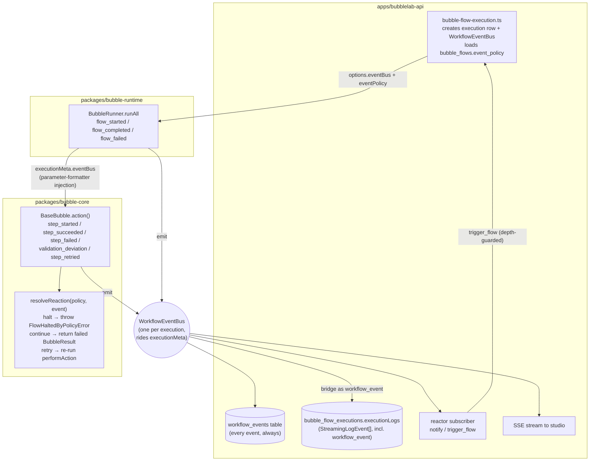

# Errors as Events — Technical Design

Branch: `feature/errors-as-events` (base `integration/live-testing` @ cdc84d0). Clone: `/home/unix/bubblelab-events`.
Status: design for review; implementation lands on the branch only, never on main until approved.

The model: every error becomes a first-class TYPED EVENT on one bus. An error event is a condition
like any other — a declarative policy maps it to a reaction (halt the flow, retry the step, notify,
trigger another flow), the same way an if-else branches on a value. Telemetry-first: every error and
its type is always emitted and persisted for an agent to inspect, regardless of what the user sees.
The user declares which deviations halt the whole flow; nothing is hardcoded per generated script.

---

## 1. Original state (verified in code, all anchors on `feature/errors-as-events` = cdc84d0 content)

### 1.1 The per-bubble error path

`packages/bubble-core/src/types/base-bubble-class.ts`:

- `action()` (`:253`) is the single execution wrapper every bubble runs through. It returns a
  `BubbleResult { success, data, error, executionId, timestamp }` envelope.
- A HARD failure (exception inside `performAction`) is caught at `:318`, logged via
  `logger.logBubbleExecutionComplete` (`:320-330`), and re-thrown as a typed
  `BubbleExecutionError` (`:334-342`) carrying `variableId`, `bubbleName`, `executionPhase`.
- A RESULT-SCHEMA deviation (`resultSchema.parse` fails, `:348`) produces an
  expected-vs-actual diff via `formatSchemaExpectedVsActual` (`:381-384`), is logged, then thrown as
  a typed `BubbleValidationError` (`:401-405`).
- An INPUT-SCHEMA failure throws `BubbleValidationError` from the constructor (`:89-93`).
- A SOFT failure (`performAction` returned but `success:false`) only WARNS and the flow
  continues (`:366-370`): "The flow will continue to run unless you manually catch and handle the
  error." The user has no declarative way to make a soft failure halt.

The typed hierarchy lives in `packages/bubble-core/src/types/bubble-errors.ts`: `BubbleError`
(`:10`), `BubbleValidationError` (`:43`), `BubbleExecutionError` (`:65`). All carry
`variableId` + `bubbleName`.

### 1.2 The flow-level error path

- `packages/bubble-runtime/src/runtime/BubbleRunner.ts` `runAll()` (`:404`) dynamically imports the
  generated script and calls `flowInstance.handle(payload)` (`:535`). Its catch block (`:560-690`)
  branches on `BubbleValidationError` / `BubbleExecutionError` / `BubbleError` / generic, logs
  `logger.fatal`, and collapses everything into `ExecutionResult { success:false, error: string }`.
  The typed class DIES here — downstream only a string survives.
- `apps/bubblelab-api/src/services/bubble-flow-execution.ts` writes ONE row per run to
  `bubble_flow_executions` — insert at `:118-126`, success update `:164-176`, failure update
  `:199-210` — with `status` and a single `error` string
  (`apps/bubblelab-api/src/db/schema-sqlite.ts:74-89`). No per-step, no error type, no code.

### 1.3 Existing event-shaped machinery (the conventions to reuse)

- There is NO event emitter/bus today. The closest pattern is the streaming seam:
  `StreamingLogEvent` (`packages/bubble-shared-schemas/src/streaming-events.ts:12-85`), a `type`-
  discriminated object pushed through `StreamCallback` (`:172`). `StreamingBubbleLogger`
  (`packages/bubble-core/src/logging/StreamingBubbleLogger.ts`) converts log calls into these
  events; the API's `collectionCallback` (`bubble-flow-execution.ts:135-142`) collects every one
  into `bubble_flow_executions.executionLogs`. This is write-only telemetry: nothing subscribes,
  nothing branches on it.
- `BubbleLogger` has `logControlFlow` (`packages/bubble-core/src/logging/BubbleLogger.ts:288-299`)
  and `logBubbleExecutionComplete` (`:245-267`) — again write-only.
- Context threading: generated code instantiates every bubble with a context literal
  `{logger, variableId, dependencyGraph, currentUniqueId, invocationCallSiteKey, executionMeta: __bubbleFlowSelf.__executionMeta__}`
  (`packages/bubble-runtime/src/utils/parameter-formatter.ts:98,156,199`). `ExecutionMeta`
  (`packages/bubble-shared-schemas/src/execution-meta.ts:65-137`) is the established channel for
  threading runtime capabilities into every bubble without rewriting scripts — `testMode`,
  `approvedWriteCallSites`, and `recordedMockProvider` already ride it.
- The engine already models control flow as data: `ControlFlowWorkflowNode`, `TryCatchWorkflowNode`,
  `ParallelExecutionWorkflowNode` (`packages/bubble-runtime/src/extraction/BubbleParser.ts:17-26`;
  types in `packages/bubble-shared-schemas/src/bubble-definition-schema.ts:302-345`). Conditions are
  first-class nodes; errors are not — that asymmetry is what this design removes.
- Sanitizers exist: `sanitizeErrorMessage` (`packages/bubble-core/src/utils/error-sanitizer.ts:104`),
  `getSafeErrorMessage` (`packages/bubble-runtime/src/utils/error-sanitizer.ts:94`).

## 2. Delta (file by file)

All changes are ADDITIVE. The `BubbleResult` envelope, the typed-error throws, and the logger calls
stay exactly as they are; events are emitted alongside them. With no bus and no policy present,
behavior is byte-identical to today.

### packages/bubble-shared-schemas (new module + 2 touched files)

| File                           | Change                                                                                                                                                                                                       |
| ------------------------------ | ------------------------------------------------------------------------------------------------------------------------------------------------------------------------------------------------------------ |
| `src/workflow-events.ts` (NEW) | Zod `workflowEventSchema` (discriminated union on `type`), `WorkflowEvent` type, `WorkflowEventCode` enum, `WorkflowEventBus` class, `workflowEventPolicySchema` + `resolveReaction()` pure matcher.         |
| `src/execution-meta.ts`        | Add `eventBus?: WorkflowEventBus; eventPolicy?: WorkflowEventPolicy` to `ExecutionMeta` (`:65`). Rides the existing context injection unchanged.                                                             |
| `src/streaming-events.ts`      | Add `'workflow_event'` to the `StreamingLogEvent.type` union (`:13`) + optional `workflowEvent?: WorkflowEvent` field, so every bus event also lands in the existing SSE stream and `executionLogs` capture. |
| `src/index.ts`                 | Export the new module.                                                                                                                                                                                       |

### packages/bubble-core (2 touched files)

| File                             | Change                                                                                                                                                                                                                                                                                                                                                                                                                                                                                            |
| -------------------------------- | ------------------------------------------------------------------------------------------------------------------------------------------------------------------------------------------------------------------------------------------------------------------------------------------------------------------------------------------------------------------------------------------------------------------------------------------------------------------------------------------------- |
| `src/types/bubble-errors.ts`     | Add `FlowHaltedByPolicyError extends BubbleError` (carries `eventCode`, `ruleIndex`). Thrown when a policy says halt; the existing `BubbleRunner` catch handles it as a `BubbleError` with zero changes.                                                                                                                                                                                                                                                                                          |
| `src/types/base-bubble-class.ts` | `action()` gains an attempt loop + event emission at the four existing decision points (hard error `:318`, result deviation `:373`, soft failure `:366`, success). Constructor emits `validation_deviation` (code `INPUT_SCHEMA_VALIDATION_FAILED`) before its existing throw (`:89`). Flow-control reactions (halt / continue / retry) are applied HERE because this is where the throw-vs-return decision already lives. Messages pass through `sanitizeErrorMessage` before entering an event. |

### packages/bubble-runtime (1 touched file)

| File                          | Change                                                                                                                                                                                                                                                                                                                                                                         |
| ----------------------------- | ------------------------------------------------------------------------------------------------------------------------------------------------------------------------------------------------------------------------------------------------------------------------------------------------------------------------------------------------------------------------------ |
| `src/runtime/BubbleRunner.ts` | `BubbleRunnerOptions` gains `eventBus?` / `eventPolicy?`; both are merged into `executionMeta` (`:505-518`) so the existing parameter-formatter injection threads them into every bubble. `runAll()` emits `flow_started` before `handle` (`:535`), `flow_completed` on success, `flow_failed` (code `FLOW_HALTED_BY_POLICY` vs `FLOW_FATAL`) in the catch block (`:560-690`). |

### apps/bubblelab-api (5 touched files + migration)

| File                                                                       | Change                                                                                                                                                                                                                                                                                                                                                                                                                             |
| -------------------------------------------------------------------------- | ---------------------------------------------------------------------------------------------------------------------------------------------------------------------------------------------------------------------------------------------------------------------------------------------------------------------------------------------------------------------------------------------------------------------------------- |
| `src/db/schema-sqlite.ts`, `src/db/schema-postgres.ts`, `src/db/schema.ts` | NEW table `workflow_events` (per-event telemetry row, FK to `bubble_flow_executions` + `bubble_flows`); NEW column `bubble_flows.event_policy` (JSON). Drizzle migration 0018 for both dialects.                                                                                                                                                                                                                                   |
| `src/services/bubble-flow-execution.ts`                                    | Creates the `WorkflowEventBus` per execution (it knows the execution row id from `:118-126`). Subscribes three handlers: (1) persist every event to `workflow_events`, (2) bridge every event into the existing `collectionCallback` as a `workflow_event` `StreamingLogEvent`, (3) the reactor: resolves `notify` / `trigger_flow` reactions for failure-class events. Loads `bubble_flows.event_policy`, passes bus+policy down. |
| `src/services/execution.ts`                                                | `ExecutionOptions` gains `eventBus?` / `eventPolicy?`; forwarded into `BubbleRunner` options (`:111-121`).                                                                                                                                                                                                                                                                                                                         |
| `src/routes/bubble-flows.ts`                                               | NEW `PUT /bubble-flow/:id/event-policy` (zod-validated by `workflowEventPolicySchema`) and NEW `GET /bubble-flow/:id/events?executionId=` so agents can inspect the full typed event log.                                                                                                                                                                                                                                          |

## 3. New state (end architecture)

### 3.1 The event type

One zod-validated union (all messages pre-sanitized, `payload` never carries credentials):

```ts
type WorkflowEvent = {
  type:
    | 'flow_started'
    | 'flow_completed'
    | 'flow_failed'
    | 'step_started'
    | 'step_succeeded'
    | 'step_failed'
    | 'step_retried'
    | 'validation_deviation'
    | 'reaction_applied'
    | 'event_bus_error';
  code: WorkflowEventCode; // stable, machine-branchable, e.g. BUBBLE_EXECUTION_ERROR
  severity: 'info' | 'warning' | 'error' | 'fatal';
  timestamp: string; // ISO
  stepId?: string; // currentUniqueId ?? invocationCallSiteKey
  variableId?: number;
  bubbleName?: string;
  message: string; // sanitized
  errorClass?: string; // 'BubbleExecutionError' | 'BubbleValidationError' | ...
  payload: Record<string, unknown>; // per-type narrowed by the union
};
```

Codes: `FLOW_STARTED, FLOW_COMPLETED, FLOW_FATAL, FLOW_HALTED_BY_POLICY, STEP_STARTED,
STEP_SUCCEEDED, BUBBLE_EXECUTION_ERROR, BUBBLE_SOFT_FAILURE, INPUT_SCHEMA_VALIDATION_FAILED,
RESULT_SCHEMA_DEVIATION, STEP_RETRIED, REACTION_APPLIED, EVENT_BUS_ERROR`.

### 3.2 The bus

`WorkflowEventBus`: `on(type | '*', handler) => unsubscribe`, `async emit(event)`. Emit awaits
handlers sequentially so the persistence write ordering matches emission ordering; a handler that
throws is caught and counted, never allowed to break the flow (the bus is telemetry infrastructure,
not a failure source). One bus instance per execution, created where the execution row id is known.

### 3.3 The policy (errors as declarative conditions)

```ts
type WorkflowEventPolicy = {
  version: 1;
  rules: Array<{
    description?: string;
    match: {
      // all present fields must match (AND); arrays are OR within a field
      types?: WorkflowEventType[];
      codes?: WorkflowEventCode[];
      stepIds?: string[];
      bubbleNames?: string[];
      severities?: Severity[];
    };
    reaction:
      | { kind: 'halt'; message?: string }
      | { kind: 'continue' }
      | {
          kind: 'retry';
          maxAttempts?: number;
          backoffMs?: number;
          then?: 'halt' | 'continue';
        }
      | { kind: 'notify'; webhookUrl?: string; message?: string }
      | { kind: 'trigger_flow'; targetFlowId: number; haltAfter?: boolean };
  }>;
};
```

`resolveReaction(policy, event)` is a pure first-match-wins function. The policy is data on
`bubble_flows.event_policy` — per flow, per step (via `stepIds` / `bubbleNames`), set through the
API, never baked into generated code.

Reaction application is split by capability:

- **Flow-control reactions** (`halt`, `continue`, `retry`, and `trigger_flow.haltAfter`) execute in
  `BaseBubble.action()` — the one place that already decides throw-vs-return-vs-warn.
- **External reactions** (`notify`, `trigger_flow` dispatch) execute in the API-layer reactor
  subscriber — the one place with DB access, user identity, and the ability to start executions.
  `trigger_flow` re-enters `executeBubbleFlowWithTracking` for the target flow (same user),
  fire-and-forget, with a `__eventTriggerDepth` payload guard (max 2) against trigger loops.

Default when no rule matches = today's exact behavior: hard error halts (throw), soft failure warns
and continues, result deviation halts (throw). The policy only ever overrides declared cases.

### 3.4 Event flow



### 3.5 Persistence (telemetry-first)

`workflow_events`: `id, executionId FK, bubbleFlowId FK, type, code, severity, stepId, variableId,
bubbleName, message, errorClass, payload JSON, timestamp, createdAt`. Every event is inserted as it
is emitted — before any reaction runs — so even a halted flow leaves the complete typed trail. A
persistence failure is caught and logged; it never fails the execution. Events additionally appear
in `executionLogs` via the bridge, so existing history replay and SSE streaming show them with zero
UI plumbing.

## 4. Expected effects

Behavioral:

- No policy configured → identical behavior to today, plus a complete typed event trail.
- A user can declare "result-schema deviation on step X halts the flow" — impossible today (soft
  failures and deviations were warn-and-continue or hardcoded throws).
- A user can declare retry-with-backoff per step/code without touching generated code.
- A user can declare "on BUBBLE_EXECUTION_ERROR in step Y, trigger flow 42" — errors become
  triggers, symmetric with conditions.
- `continue` on a hard error is opt-in only; the default hard-error throw is unchanged.
- Generated scripts with their own try/catch may intercept `FlowHaltedByPolicyError` like any
  error; the halt event is still persisted (emitted before the throw). Documented limitation.

Telemetry:

- Every error carries `code + errorClass + stepId + variableId` into a queryable table, replacing
  "one string per run" as the only durable error record. Agents inspect via
  `GET /bubble-flow/:id/events`.
- The machinery reports on itself: `step_retried`, `reaction_applied`, `event_bus_error` are events
  like any other (matches the project-wide programmatic-telemetry principle).

UX:

- The studio's SSE stream now includes `workflow_event` entries; unknown types are ignored by the
  current UI, so no frontend change is required for this branch. A later branch can render them.
- One new settings surface: the per-flow event policy (PUT endpoint now; UI later).

Performance: one bus emit per step lifecycle event + one DB insert per event, awaited sequentially.
For typical flows (≤ dozens of steps) this is noise relative to bubble I/O.

## 5. Design-pattern fit

- **`BubbleResult` envelope** — untouched. Events are observations ABOUT results, emitted at the
  seams where the envelope is built (`base-bubble-class.ts:350-372,410-434`). The envelope stays the
  API of record for the caller; the event is the record for everyone else.
- **Typed-error hierarchy** — events carry the class name (`errorClass`) and a stable `code`, so the
  type information that currently dies at `BubbleRunner.ts:560-690` (collapsed to a string) survives
  into persistence. `FlowHaltedByPolicyError` extends `BubbleError`, so every existing catch branch
  and test that handles `BubbleError` keeps working unchanged.
- **`WorkflowNode` taxonomy** — `ControlFlowWorkflowNode` made conditions data
  (`bubble-definition-schema.ts:320`); `workflowEventPolicySchema` makes error-handling data the
  same way. The invariant: **an error event and a condition are the same branchable thing** — a
  typed value matched declaratively to a branch (reaction). `TryCatchWorkflowNode` (`:335`) remains
  the imperative escape hatch; the policy is the declarative default.
- **`BubbleLogger` / streaming seam** — the bus reuses the proven shape (`type`-discriminated
  objects, callback fan-out, collect-then-persist) instead of inventing a parallel one, and bridges
  into `StreamingLogEvent` so the existing capture path (`bubble-flow-execution.ts:135-142`) stores
  events without modification.
- **`ExecutionMeta` threading** — the bus and policy ride the exact channel `testMode` /
  `recordedMockProvider` already proved out (`parameter-formatter.ts:98,156,199`): no script
  rewriting, no injector changes.
- **Planned DAO (`workflow_events` / `step_executions`, PROGRESS.md "DB redesign")** — this branch
  ships `workflow_events` now with the exact identity fields (`stepId`, `variableId`,
  `bubbleName`) the normalized DAO needs. `step_executions` later becomes a projection of
  `step_started`/`step_succeeded`/`step_failed` pairs — the event log is the source of truth the
  DAO can materialize from, so this work is a down payment on the redesign, not a rival schema.
- **Why it generalizes (Contract-KB / watchdog unification)** — a `resultSchema` deviation already
  produces an expected-vs-actual diff (`base-bubble-class.ts:381-384`); this design gives it a code
  (`RESULT_SCHEMA_DEVIATION`) and a diff-carrying payload on the same bus as every other error. A
  future contract-drift watchdog is then just another subscriber plus policy rules — no new
  plumbing per deviation kind. One flow (emit → persist → match → react) serves every current and
  future deviation source; adding a kind means adding a code, not a mechanism.

## 6. Staged / deferred

- `trigger_flow` ships functional (API reactor, same-user, depth-guarded, fire-and-forget). Staged
  hardening for a later branch: queue/backpressure, cross-user authorization model, cycle detection
  across more than 2 hops, propagating a `triggeredBy` link column.
- `step_executions` table: deferred to the DAO redesign (see fit section); the event log already
  carries everything it needs.
- Studio UI for policies and event timelines: separate branch.
- `notify` channels beyond stream + webhook (e.g. Telegram bubble reuse): extension point via the
  reactor; the reaction schema already carries `webhookUrl`.

## 7. Verification plan

- Unit (vitest, shared-schemas): schema round-trips, bus subscribe/emit/isolation, `resolveReaction`
  precedence and AND/OR matching.
- Unit (vitest, bubble-core): stub bubble — default behavior unchanged with no bus/policy; events
  emitted for hard error / soft failure / result deviation / success; retry loop honors
  maxAttempts + then; halt-on-soft-failure throws `FlowHaltedByPolicyError`; continue-on-hard-error
  returns a failed `BubbleResult`.
- Regression: full existing `bubble-core` + `bubble-runtime` vitest suites must pass.
- Build: `shared-schemas → bubble-core → bubble-runtime → api` tsc/build clean.

## References

Repo anchors (branch `feature/errors-as-events`): all `file:line` citations above. External:

- Zod discriminated unions — https://zod.dev/?id=discriminated-unions (zod v3, matches repo usage in `bubble-definition-schema.ts`)
- Drizzle ORM SQLite/Postgres column types — https://orm.drizzle.team/docs/column-types/sqlite , https://orm.drizzle.team/docs/column-types/pg (matches `schema-sqlite.ts` / `schema-postgres.ts` conventions)
